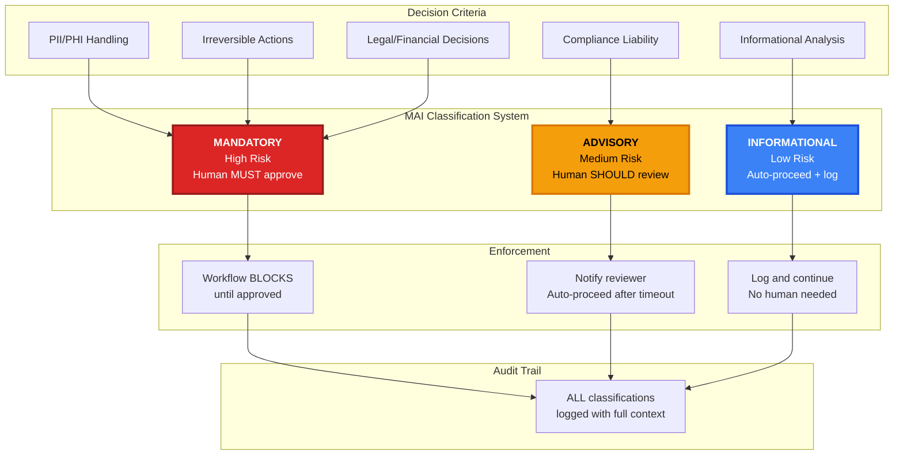
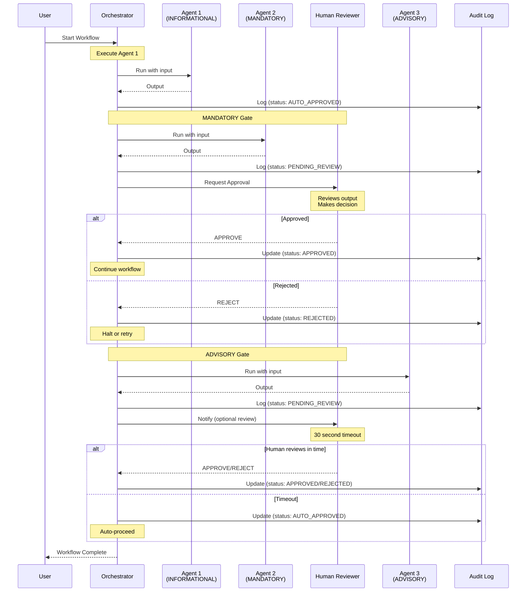
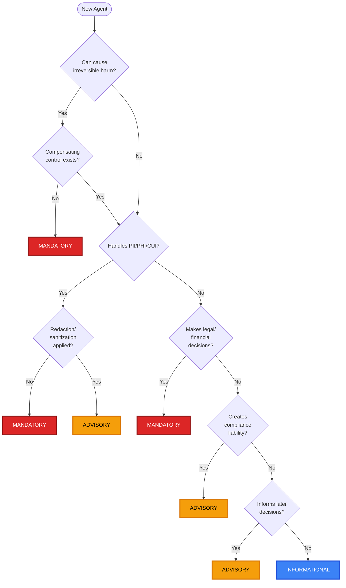
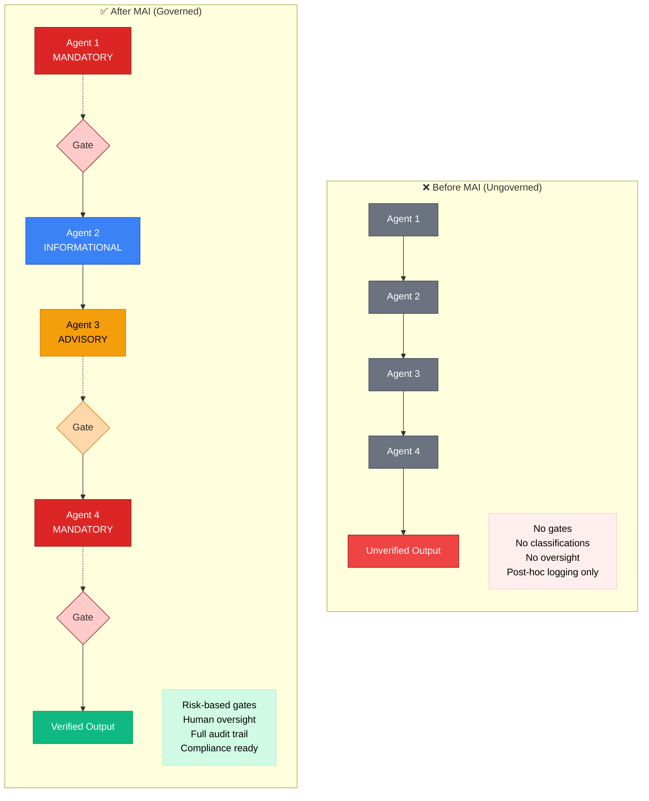
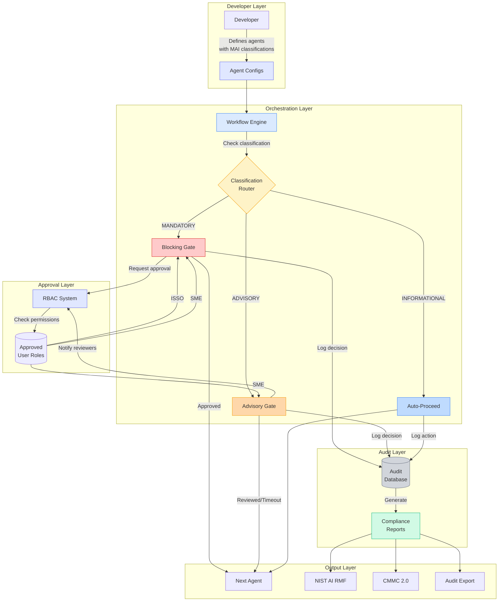
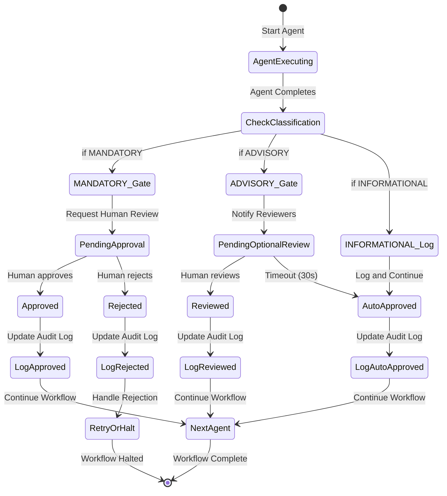

# MAI Pattern Visual Diagrams

This document contains visual representations of the MAI Classification System for use in presentations, documentation, and publications.

---

## Diagram 1: MAI Classification Overview



---

## Diagram 2: Workflow Execution with MAI Gates



---

## Diagram 3: Agent Classification Decision Tree



---

## Diagram 4: VA Claims Workflow with MAI Classifications

```mermaid
flowchart LR
    subgraph Input
        Files[Medical/Legal<br/>Documents]
    end

    subgraph Agents
        direction TB

        A1[Unified Gateway<br/>PII Redaction]
        A2[Document Intake<br/>File Organization]
        A3[Timeline Builder<br/>Chronology]
        A4[Evidence Validator<br/>38 CFR Mapping]
        A5[C&P Examiner<br/>Clinical Lens]
        A6[Quality Assurance<br/>Logic Check]
        A7[Report Generator<br/>Final Output]
        A8[Telemetry<br/>Compliance Metrics]

        A1 -.->|MANDATORY Gate| H1{Human<br/>Approval}
        H1 -->|Approved| A2

        A2 --> A3

        A3 --> A4
        A4 -.->|ADVISORY Gate| H2{Human<br/>Review?}
        H2 -->|Reviewed/Timeout| A5

        A5 -.->|ADVISORY Gate| H3{Human<br/>Review?}
        H3 -->|Reviewed/Timeout| A6

        A6 -.->|ADVISORY Gate| H4{Human<br/>Review?}
        H4 -->|Reviewed/Timeout| A7

        A7 -.->|MANDATORY Gate| H5{Human<br/>Approval}
        H5 -->|Approved| A8
    end

    subgraph Output
        Report[Evidence Chain<br/>Validation Report]
        Audit[Audit Trail<br/>CMMC Dashboard]
    end

    Files --> A1
    A8 --> Report
    A8 --> Audit

    style A1 fill:#dc2626,stroke:#991b1b,color:#fff,stroke-width:2px
    style A7 fill:#dc2626,stroke:#991b1b,color:#fff,stroke-width:2px
    style A4 fill:#f59e0b,stroke:#d97706,color:#000,stroke-width:2px
    style A5 fill:#f59e0b,stroke:#d97706,color:#000,stroke-width:2px
    style A6 fill:#f59e0b,stroke:#d97706,color:#000,stroke-width:2px
    style A2 fill:#3b82f6,stroke:#1d4ed8,color:#fff,stroke-width:2px
    style A3 fill:#3b82f6,stroke:#1d4ed8,color:#fff,stroke-width:2px
    style A8 fill:#3b82f6,stroke:#1d4ed8,color:#fff,stroke-width:2px

    style H1 fill:#fecaca,stroke:#991b1b
    style H5 fill:#fecaca,stroke:#991b1b
    style H2 fill:#fed7aa,stroke:#d97706
    style H3 fill:#fed7aa,stroke:#d97706
    style H4 fill:#fed7aa,stroke:#d97706
```



---

## Diagram 5: Comparison - Before vs After MAI



---

## Diagram 6: MAI System Architecture



---

## ASCII Art Version (For Plain Text)

```
┌─────────────────────────────────────────────────────────────────┐
│                  MAI CLASSIFICATION SYSTEM                      │
├─────────────────────────────────────────────────────────────────┤
│                                                                 │
│  ┌─────────────────┐                                           │
│  │   MANDATORY     │  ← High Risk                              │
│  │  Human MUST     │    • PII/PHI handling                     │
│  │   approve       │    • Irreversible actions                 │
│  └────────┬────────┘    • Legal/financial decisions            │
│           │                                                     │
│           ├─→ Workflow BLOCKS until approved                   │
│           └─→ Full audit trail with reviewer ID                │
│                                                                 │
│  ┌─────────────────┐                                           │
│  │    ADVISORY     │  ← Medium Risk                            │
│  │  Human SHOULD   │    • Compliance liability                 │
│  │   review        │    • Contextual judgments                 │
│  └────────┬────────┘    • Quality assurance                    │
│           │                                                     │
│           ├─→ Notify reviewer, auto-proceed after timeout      │
│           └─→ Full audit trail (approved/auto-approved)        │
│                                                                 │
│  ┌─────────────────┐                                           │
│  │ INFORMATIONAL   │  ← Low Risk                               │
│  │ Auto-proceed    │    • Data gathering                       │
│  │   with log      │    • File organization                    │
│  └────────┬────────┘    • Timeline construction                │
│           │                                                     │
│           ├─→ Continue immediately                             │
│           └─→ Full audit trail (auto-approved)                 │
│                                                                 │
└─────────────────────────────────────────────────────────────────┘
```

---

## Diagram 7: Risk → Classification Mapping

```
Risk Assessment Matrix:

                        │ Low Impact │ Med Impact │ High Impact │
                        ├────────────┼────────────┼─────────────┤
Impossible to Occur     │     I      │     I      │      A      │
                        ├────────────┼────────────┼─────────────┤
Unlikely to Occur       │     I      │     A      │      A      │
                        ├────────────┼────────────┼─────────────┤
Likely to Occur         │     A      │     A      │      M      │
                        ├────────────┼────────────┼─────────────┤
Almost Certain          │     A      │     M      │      M      │
                        └────────────┴────────────┴─────────────┘

Legend:
  I = INFORMATIONAL (auto-proceed + log)
  A = ADVISORY (notify + optional review)
  M = MANDATORY (human must approve)
```

---

## Diagram 8: Approval Flow State Machine



---

## Usage Guidelines

### For Presentations (PowerPoint/Google Slides)
- Use **Diagram 1** for overview/introduction
- Use **Diagram 3** for explaining how to classify agents
- Use **Diagram 5** for before/after comparison

### For Documentation
- Use **Diagram 2** for technical workflow explanation
- Use **Diagram 4** for real-world example (VA Claims)
- Use **Diagram 6** for system architecture

### For GitHub README
- All Mermaid diagrams render automatically
- Use **Diagram 1, 4, 5** for visual appeal

### For Academic Papers
- Use **Diagram 3** (decision tree) in methodology
- Use **Diagram 8** (state machine) for formal specification
- Include ASCII art version for accessibility

### For Blog Posts/Medium
- Use **Diagram 5** (before/after) for engagement
- Use **Diagram 1** for quick understanding
- Screenshot and annotate diagrams for clarity

---

## Diagram Color Scheme

**MANDATORY:** 🔴 Red (#dc2626)
- Conveys "stop, human required"
- High urgency, critical decision

**ADVISORY:** 🟠 Amber/Orange (#f59e0b)
- Conveys "caution, review recommended"
- Medium priority, important but not blocking

**INFORMATIONAL:** 🔵 Blue (#3b82f6)
- Conveys "information, proceeding"
- Low priority, routine operation

**Approved/Success:** 🟢 Green (#10b981)
**Rejected/Danger:** 🔴 Red (#ef4444)
**Neutral/System:** ⚪ Gray (#6b7280)

---

## Exporting Diagrams

### As PNG (for presentations)
1. Copy Mermaid code
2. Paste into https://mermaid.live/
3. Export as PNG/SVG
4. Download and use in slides

### As SVG (for papers)
- Same process, choose SVG for scalability
- Editable in Inkscape/Illustrator

### As Code (for blogs)
- Many platforms (GitHub, GitLab, Notion) render Mermaid natively
- Just paste the code block

---

**Created:** January 2026
**Author:** William J. Storey III
**License:** CC BY 4.0
